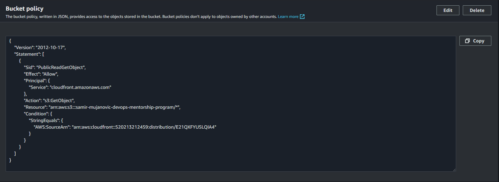
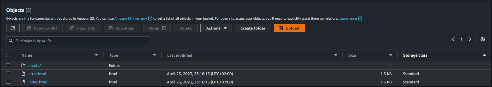
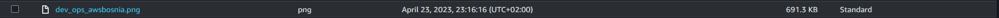
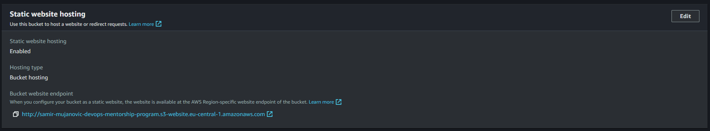
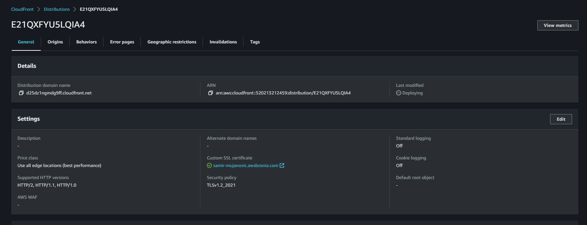
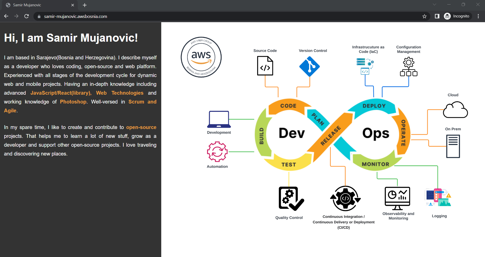
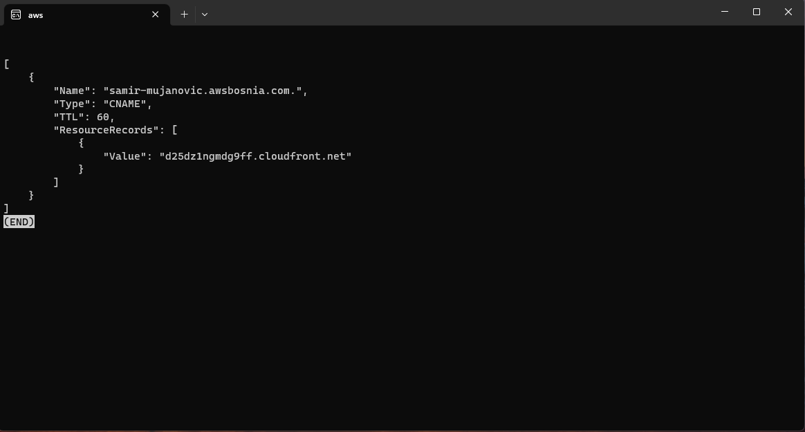

### TASK-9: Static website with S3 and CloudFront
- Tasks:
    - [x] S3 bucket policy screenshot ( voditi računa da su minimalne permisije postavljene),

        

    - [x] .html i error.html file, DevOps image,
    
        
        Devops image stored in assets folder
        

    - [x] Screenshot - S3 website endpointa,

        [http://samir-mujanovic-devops-mentorship-program.s3-website.eu-central-1.amazonaws.com](http://samir-mujanovic-devops-mentorship-program.s3-website.eu-central-1.amazonaws.com)

        

    - [x] Screenshot - distribution endpointa,

        [https://d25dz1ngmdg9ff.cloudfront.net](https://d25dz1ngmdg9ff.cloudfront.net)

        

    - [x] Screenshot - R53 recorda koji je uspješno izvršio load distribucije,

        [https://samir-mujanovic.awsbosnia.com](https://samir-mujanovic.awsbosnia.com)

        

    - [x] Screenshot konfigurisanoga R53 recorda prema distribuciji.

         