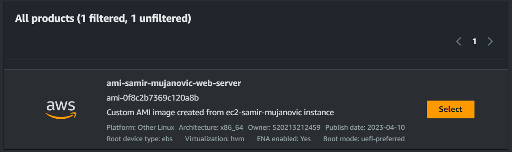
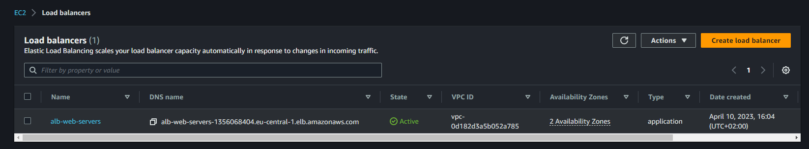
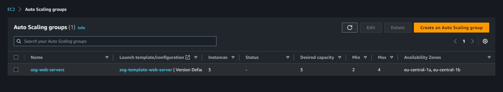
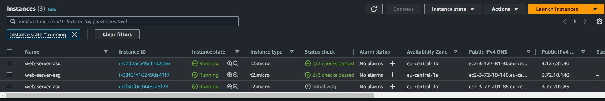
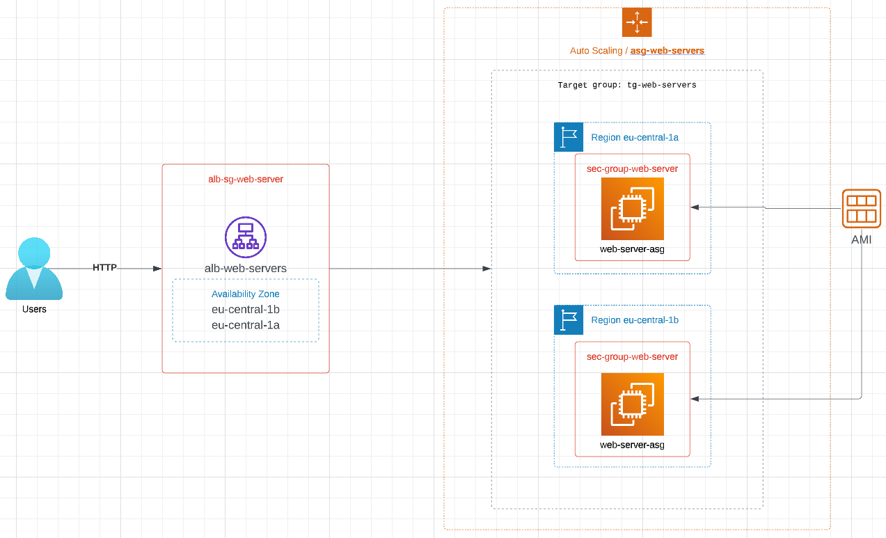

### TASK no. 7

TASK-7: Autoscaling Group and Load Balancer

- Task obuhvata:
    - [x] Azuriranje permisija za `IAM 2 User-a` na nacin da se doda u grupu `Administrators`.
    - [x] Kreiranje AMI image-a od instance `ec2-ime-prezime-web-server`. AMI image imenovati `ami-prezime-ime-web-server`.
    - [x] Kreirati Application Load Balancer naziva `alb-web-servers` koji ce biti povezan sa Target Group `tg-web-servers`.
    - [x] Kreirati ASG sa MIN 2 i MAX 4 instance. Tip instance koji cete koristiti unutar ASG je `t2.micro` ili `t3.micro` gdje cemo koristiit `alb-web-servers` Load Balancer. ASG bi trebala da skalira prema gore (scale-up) kad CPU predje `18%` i skalira prema dole (scale down) kad god CPU Utilisation padne ispod `18%`.
    - [x] Security grupe dozvoljavaju najmanje potrebne otvorene portove.
    - [x] Kreiran account na lucidchart.com i napravljen dijagram infrastrukture.
    - [x] Simulirana visoka dostupnost na nacin da su terminirane instance.
    - [x] Simuliran CPU load.

### Screenshots related to task completion:

#### AMI image

#### Kreiran ALB koji je povezan sa Target Group.

#### Kreiran ASG sa MIN 2 i MAX 4 instance. 

#### Kreirane 3 instace pomocu autoscaling group

#### Dijagram infrastrukture sa lucidchart.com

#### 8 DNS Record Load Balancera 

[http://alb-web-servers-1356068404.eu-central-1.elb.amazonaws.com/](http://alb-web-servers-1356068404.eu-central-1.elb.amazonaws.com/)
