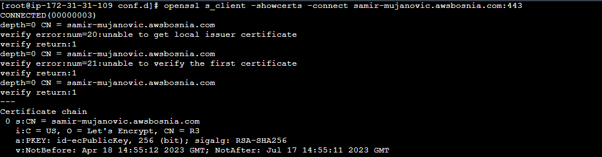

### TASK-8: Implement SSL Let's Encrypt, migrate to AWS SSM

- Tasks:
    - [x] Od AMI image ec2-ime-prezime-web-server napravite novu EC2 instancu ec2-ime-prezime-task-8

        

    - [x]  Kreirati DNS record

        ```Komanda koju sam koristio:```

      ```bash
        $ aws route53 change-resource-record-sets --hosted-zone-id Z3LHP8UIUC8CDK --change-batch file://create-config.json 
         ```
        create-config.json
        ```yaml
        {
            "Comment": "CREATE a record ",
            "Changes": [{
                "Action": "CREATE",
                "ResourceRecordSet": {
                        "Name": "samir-mujanovic.awsbosnia.com",
                        "Type": "A",
                        "TTL": 60,
                        "ResourceRecords": [{ "Value": "18.159.60.70"}]
            }}]
        }
         ```
        

        Kada ste dodali novi DNS record njegov Name i Value ispiste Name i Value.

        ```Komanda koju sam koristio:```

        ```bash 
        $ aws route53 list-resource-record-sets --hosted-zone-id Z3LHP8UIUC8CDK --query "ResourceRecordSets[?Name == 'samir-mujanovic.awsbosnia.com.'].[Name, ResourceRecords[0].Value]"
        ```

        

    - [x] Na EC2 instanci ec2-ime-prezime-task-8 kreirati Let's Encrypt SSL certifikat za vasu domenu. Neophodno je omoguciti da se nodejs aplikaciji moze pristupiti preko linka https://<ime>-<prezime>.awsbosnia.com, to verifikujte skrinsotom gdje se vidi validan certifikat u browseru.

         

    
    - [x] Omoguciti autorenewal SSL certifikata

        ```Komande koje sam koristio za autorenewal:``` 
        
        ```bash 
            $ sudo yum install cronie -y #instalacija cronie
            $ sudo systemctl enable crond.service # enable cond.service tokom podizanja instance
            $ sudo systemctl start crond.service # crond.service pokretanje servisa
            $ crontab -e # otvaranje crontaba fajla
            0 12 * * * /usr/bin/certbot renew --quiet #zatim sam dodao ovu komandu koja ce provjeravati da li certifikat istica za 30 dana, ako da uradit ce autorenewal certifikata , --quite direktiva govori certbot da ne generise outpu.
        ```
        
    - [x] Koristeci openssl komande prikazati koji SSL certitikat koristite i datum njegovog isteka.

        ```Komande koje sam koristio:``` 

        ```bash
        $ openssl s_client -showcerts -connect samir-mujanovic.awsbosnia.com:443 #komanda koristena za prikaz informacija o certifikatu
        ```
        
        
        ```bash
        $ openssl s_client -showcerts -connect samir-mujanovic.awsbosnia.com:443 2>/dev/null | openssl x509 -noout -text # komanda koristena za prikaz informacija o certifikatu
         ```
        
        

        ```bash 
        $ openssl s_client -showcerts -connect samir-mujanovic.awsbosnia.com:443 2>/dev/null | openssl x509 -noout -dates # komanda koristena za prikaz datuma certificate validity
        ```
        

    - [x] Importujte Lets Encrypt SSL certifikat unutar AWS Certified Managera.

        

    - [x] Kreirajte Load Balancer gdje cete na nivou Load Balancera da koristite SSL cert koji ste ranije importovali. (Hint: NGINX config je nophodno auzrirati). 

        

    - [x] Koristeci openssl komande prikazati koji SSL certitikat koristite za vasu domenu i  datum njegovog isteka.    

        ```bash
        $ openssl s_client -showcerts -connect samir-mujanovic.awsbosnia.com:443 #komanda koristena za prikaz informacija o certifikatu
        ```
        
        
        ```bash 
        $ openssl s_client -showcerts -connect samir-mujanovic.awsbosnia.com:443 2>/dev/null | openssl x509 -noout -dates # komanda koristena za prikaz datuma certificate validity
        ```
        

    - [x] Kreirajte novi SSL certifikat unutar AWS Certified Managera, azurirajte ALB da koristi novi SSL cert koji ste kreirali.

        

        Load Balancer

        

        Browser certificate

        

    - [x] Koristeci openssl komande prikazati koji SSL certitikat koristite za vasu domenu i datum njegovog isteka.
        
        Dates

        ```bash 
        $ openssl s_client -showcerts -connect samir-mujanovic.awsbosnia.com:443 2>/dev/null | openssl x509 -noout -dates # komanda koristena za prikaz datuma certificate validity
        ```

        

        SSL aws certifikat

        ```bash
        $ openssl s_client -showcerts -connect samir-mujanovic.awsbosnia.com:443 #komanda koristena za prikaz informacija o certifikatu
        ```

        

    - [x] Kada zavrsite sa taskom kreirajte AMI image pod nazivom ami-ec2-ime-prezime-task-8 i terminirajte resurse koje ste koristili za izradu taska.

        